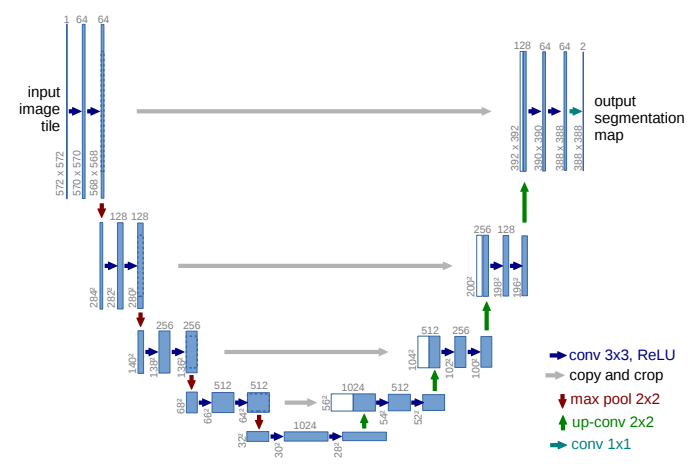
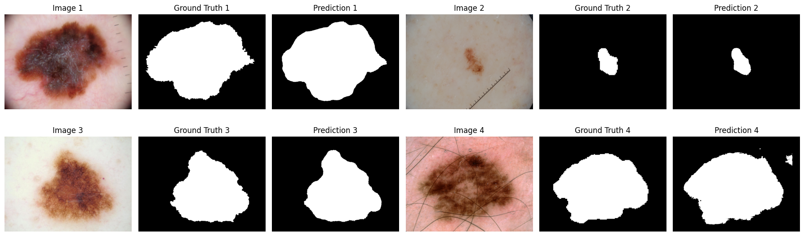
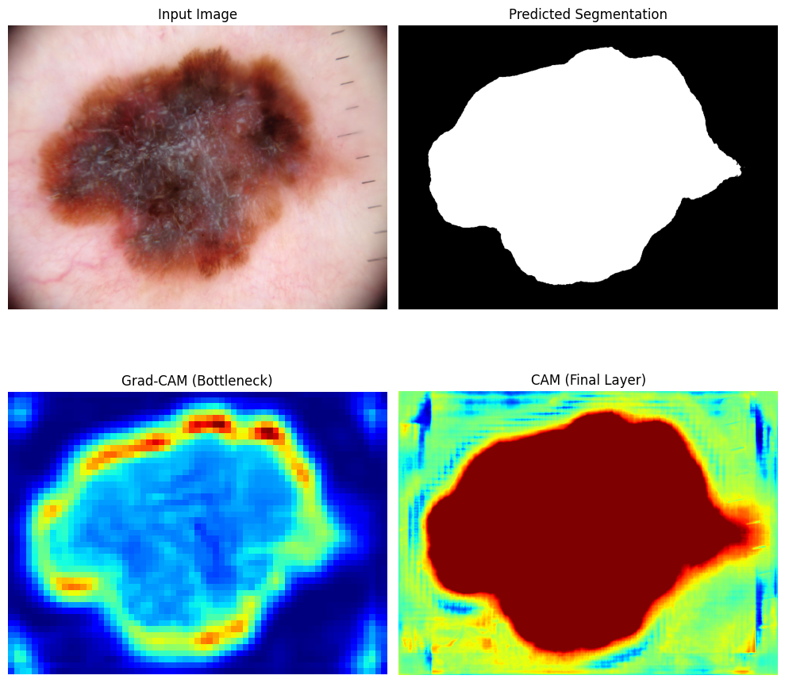
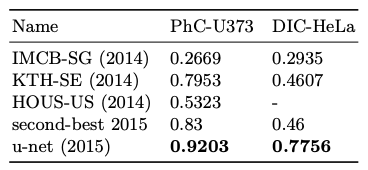

> This report covers medical image segmentation using U-Net, U-NET++, and PSPNet. These models are ran on ISIC and AMOS datasets. 


<!--more-->
{: class="table-of-content"}
* TOC
{:toc}

## Introduction
Medical image segmentation involves taking a medical image obtained from MRI/CT/etc. and segmenting different parts of the image. More specifically, given a 2D or 3D medical image, the goal is to produce a segmentation mask of the same dimension as the input. Labels in this mask correspond semantically to relevant parts of the image that are classified based on predefined classes. Some examples of classes include background, organ, and lesion. Unlike normal image classification tasks or most image segmentation tasks, medical image segmentation requires a very high level of accuracy. Radiologists who work with these images are trained for years to be able to accurately segment these images and identify lesions accurately. However, there are many more medical images than doctors that can make accurate diagnoses in the world, and so medical image segmentation attempts to solve this problem. Essentially, medical image segmentation aims to assist radiologists in detecting lesions from medical image scans and identifying regions of interest in an organ, reducing the amount of time radiologists may take to annotate these images. The models we will explore in this paper to implement this solution are U-Net, U-Net++, and PSPNet. 

## Dataset
The dataset used for this paper comes from ISIC (International Skin Imaging Collaboration), specifically the ISIC challenge dataset from 2017 [1]. The training dataset consists of 2000 skin lesion images in JPEG format and 2000 superpixel masks in PNG format. The ground truth training data consists of 2000 binary mask images in PNG format, 2000 dermoscopic feature files in JSON format, and 2000 lesion diagnoses. The goal of this dataset was train models to accurately diagnose melanoma. The challenge using this dataset involved segmenting images, feature detection, and disease classification. For the purposes of this paper, we will only focus on segmenting medical images, meaning we will not be using the 2000 dermoscopic feature files and 2000 lesion diagnoses. 

## Evaluation Methods
To evaluate the architectures described in the three papers on a single dataset, we used the following metrics so our evaluation was consistent evaluation approach.

#### Mean IoU
Mean Intersection over Union (IoU) is the overlap between the predicted and ground truth segmentation masks over all test samples. Each IoU can be found by:

$\text{IoU} = \frac{\text{Intersection of Predicted and Ground Truth}}{\text{Union of Predicted and Ground Truth}}$

This gives a measure of the model's segmentation accuracy.

### Mean Dice Coefficient
Mean Dice coefficient is the similarity between the predicted and ground truth masks over all test samples and a single score can be found with:

$\text{Dice} = \frac{2 \times |\text{Intersection of Predicted and Ground Truth}|}{|\text{Predicted}| + |\text{Ground Truth}|}$

The closer to 1 the better overlap.

### Last Layer CAM
A Class Activation Map (CAM) shows the regions of the input that contributed most to the model's predictions. In our usecase of medical image segmentation CAM shows areas where the model focuses for classifying pixels as lesion or non-lesion. We implemented this and applied it to our three architectures get a better idea of the model's inner workings. Here is our implementation:

```python
class CAM:
    def __init__(self, model, target_layer):
        self.model = model
        self.target_layer = target_layer
        self.activations = None
        # this is the important line
        self.target_layer.register_forward_hook(self.save_activations)

    def save_activations(self, module, input, output):
        self.activations = output

    def compute_cam(self, input_image):
        self.model.eval()
        output = self.model(input_image)
        activations = self.activations.cpu().detach().numpy()
        weights = np.mean(output.cpu().detach().numpy(), axis=(2, 3))
        cams = []
        for img_idx in range(input_image.shape[0]):
            cam = np.zeros(activations.shape[2:], dtype=np.float32)
            for channel_idx, weight in enumerate(weights[img_idx]):
                cam += weight * activations[img_idx, channel_idx]
            cam = np.maximum(cam, 0)
            cam = cam - np.min(cam)
            cam = cam / np.max(cam)
            cams.append(cam)
        return cams
```

### Middle Layer Grad-CAM
A Gradient-weighted Class Activation Map (Grad-CAM) gives a detailed visualization of how a model's inner layers respond to an input by using gradients from the model’s backward pass during inference (which is possible by adding a PyTorch hook). Here is our implementation:

```python
class GradCAM:
    def __init__(self, model, target_layer):
        self.model = model
        self.target_layer = target_layer
        self.gradients = None
        self.activations = None
        # these are the important lines
        self.target_layer.register_forward_hook(self.save_activations)
        self.target_layer.register_backward_hook(self.save_gradients)

    def save_activations(self, module, input, output):
        self.activations = output

    def save_gradients(self, module, grad_input, grad_output):
        self.gradients = grad_output[0]

    def compute_cam(self, input_image, target_pixel=None):
        self.model.eval()
        output = self.model(input_image)
        if target_pixel is None:
            h, w = output.shape[2:]
            target_pixel = (h // 2, w // 2)
        self.model.zero_grad()
        target_value = output[0, 0, target_pixel[0], target_pixel[1]]
        target_value.backward()
        gradients = self.gradients.cpu().detach().numpy()
        activations = self.activations.cpu().detach().numpy()
        weights = np.mean(gradients, axis=(2, 3))
        cam = np.zeros(activations.shape[2:], dtype=np.float32)
        for i, w in enumerate(weights[0]):
            cam += w * activations[0, i]
        cam = np.maximum(cam, 0)
        cam = cam - np.min(cam)
        cam = cam / np.max(cam)
        return cam
```


## Model 1: U-Net
The earliest segmentation model we evaluated is U-Net, a convolutional neural network architecture designed specifically for biomedical image segmentation although today U-Net is being used for many different tasks. 

### Architecture

<br>
*U-Net Architecture diagram from [2]*

The most prominent features of U-Net's architectue are its shape and its skip connections. The shape is a result of the two halves of the down and up-sampling process and the passing of feature maps directly to later convolution layers:

#### Encoder (Contracting Path)
- Captures global context by progressively reducing the spatial dimensions of the input while extracting deeper semantic features.
- At each down-sampling step, the spatial resolution is halved, and the number of feature channels is doubled through a 2x2 max pool operation. 
- Deeper layers encode the overall structure and high-level semantics of the image.

```python
class Encoder(nn.Module):
    def __init__(self):
        super(Encoder, self).__init__()
        self.enc1 = DoubleConv(3, 64)
        self.enc2 = nn.Sequential(
            nn.MaxPool2d(kernel_size=2, stride=2),
            DoubleConv(64, 128)
        )
        self.enc3 = nn.Sequential(
            nn.MaxPool2d(kernel_size=2, stride=2),
            DoubleConv(128, 256)
        )
        self.enc4 = nn.Sequential(
            nn.MaxPool2d(kernel_size=2, stride=2),
            DoubleConv(256, 512)
        )

    def forward(self, x):
        skip_connections = []
        x = self.enc1(x)
        skip_connections.append(x)
        x = self.enc2(x)
        skip_connections.append(x)
        x = self.enc3(x)
        skip_connections.append(x)
        x = self.enc4(x)
        skip_connections.append(x)
        return x, skip_connections
```

#### Decoder (Expanding Path)
- Restores the spatial resolution of the feature maps to reconstruct the segmentation mask.
- Uses 2x2 up-sampling convolutions to increase spatial dimensions and reconstruct the segmentation mask from encoded features.
- Combines deep, semantic features with fine-grained details to produce precise segmentation maps.

```python
class Decoder(nn.Module):
    def __init__(self):
        super(Decoder, self).__init__()
        self.up4 = nn.Sequential(
            nn.ConvTranspose2d(1024, 512, kernel_size=2, stride=2),
            DoubleConv(1024, 512)
        )
        self.up3 = nn.Sequential(
            nn.ConvTranspose2d(512, 256, kernel_size=2, stride=2),
            DoubleConv(512, 256)
        )
        self.up2 = nn.Sequential(
            nn.ConvTranspose2d(256, 128, kernel_size=2, stride=2),
            DoubleConv(256, 128)
        )
        self.up1 = nn.Sequential(
            nn.ConvTranspose2d(128, 64, kernel_size=2, stride=2),
            DoubleConv(128, 64)
        )

    def forward(self, x, skip_connections):
        x = self.up4(torch.cat((skip_connections[-1], x), dim=1))
        x = self.up3(torch.cat((skip_connections[-2], x), dim=1))
        x = self.up2(torch.cat((skip_connections[-3], x), dim=1))
        x = self.up1(torch.cat((skip_connections[-4], x), dim=1))
        return x
```

#### Skip Connections
- Skip connections pass feature maps directly from the encoder to the decoder, bypassing the deeper layers of the network.
- Feature maps from the encoder are copied and cropped to match the dimensions of the decoder feature maps (to address size mismatches caused by up-sampling). These are then concatenated with the decoder feature maps.
- This allows the model to retain high-resolution spatial details that are typically lost during down-sampling.


#### Down-Up Connection
- To connect the above implemenations of the encoder and decoder we can add a layer to bridge the two.

```python
class Bottleneck(nn.Module):
    def __init__(self):
        super(Bottleneck, self).__init__()
        self.bottleneck = DoubleConv(512, 1024)

    def forward(self, x):
        return self.bottleneck(x)
```

#### Final Architecture

Combining the above components we get the following model:

```python
class UNet(nn.Module):
    def __init__(self):
        super(UNet, self).__init__()
        self.encoder = Encoder()
        self.bottleneck = Bottleneck()
        self.decoder = Decoder()
        self.final_conv = nn.Conv2d(64, 1, kernel_size=1)

    def forward(self, x):
        x, skip_connections = self.encoder(x)
        x = self.bottleneck(x)
        x = self.decoder(x, skip_connections)
        x = self.final_conv(x)
        return x
```

*Note: the provided source code structures the UNet class slightly differently than the method we used to collect results but they are sematically identical*

### Training
The U-Net model was trained on a training portion of the ISIC 2017 dataset contianing 2000 images and ground truth masks. We had the following hyperparameters for training:
- **Image Dimensions**: Height = 767, Width = 1022 (dataset images were this size)
- **Batch Size**: 4
- **Learning Rate**: 1e-3
- **Optimizer**: Adam
- **Loss Function**: Binary Cross Entropy with Logits (BCEWithLogitsLoss)
- **Number of Epochs**: 20
- **In-channels/Out-channels**: 3/1

### Results

On the test set, U-Net scored:
- **Mean Dice Coefficient on Test Set:** 0.6695
- **Mean IoU on Test Set:** 0.5642


<br>
*Four samples with their ground truth and U-Net prediction segmentation masks*

The above metrics provide and image vs ground truth vs prediction give a  quantitative and qualitative measure of U-Net's segmentation performance but understanding the model's predictions and decision-making process requires squeezing some meaning out of model layers.

#### Grad-CAM and CAM Analysis

1. **Grad-CAM (Bottleneck Layer)**:
   - Grad-CAM visualizes the focus of the bottleneck layer, which is responsible for encoding global context and structure.
   - The heatmap highlights the lesion's edges and surrounding areas, suggesting that the model leverages boundary information to differentiate lesion from non-lesion regions.

2. **CAM (Final Layer)**:
   - CAM visualizes the pixel-wise decision-making of the final layer, which produces the segmentation map.
   - The heatmap shows strong activation in regions corresponding to the lesion, with minimal attention to the surrounding healthy skin.


<br>
*Input, predicted, CAM, and Grad-CAM visualization plot*

It is hopefully clear why the U-Net structure is the way it is given the above plot.
- The bottleneck captures high-level semantic and structural information like the entire boundary around the lesion. 
- The final layer refines predictions in order to get the dense pixel-level accuracy required for segmentation. 

### Discussion

While the IoU score seems low, its hard to see this lacking qualitatively. Below is an plot with U-Net's segmentation of four input images. From a human perspective, the model appears to capture the essential features and boundaries effectively which is the main motivation behind medical image segmenation. Also here we can see U-Nets IoU scores from the original paper from another segmentation competition on cell segmentation compared to 4 other methods:


<br>
*IoU scores of U-Net compared to other methods on a cell segmentation task [2].*

For harder problems like in segmenting lesions rather than cells which are already fairly distinct from nearby structures, a score of 0.5642 is good. 

## Model 2: U-Net++
### Architecture
### Training
### Results
### Discussion


## Model 3: PSPNet
### Architecture
### Training
### Results
### Discussion


## Conclusion


## Reference

[1]  Codella N, Gutman D, Celebi ME, Helba B, Marchetti MA, Dusza S, Kalloo A, Liopyris K, Mishra N, Kittler H, Halpern A. "Skin Lesion Analysis Toward Melanoma Detection: A Challenge at the 2017 International Symposium on Biomedical Imaging (ISBI), Hosted by the International Skin Imaging Collaboration (ISIC)". arXiv: 1710.05006 

[2] Ronneberger O, Fischer P, Brox T. "U-Net: Convolutional Networks for Biomedical Image Segmentation". arXiv: 1505.04597.

---
